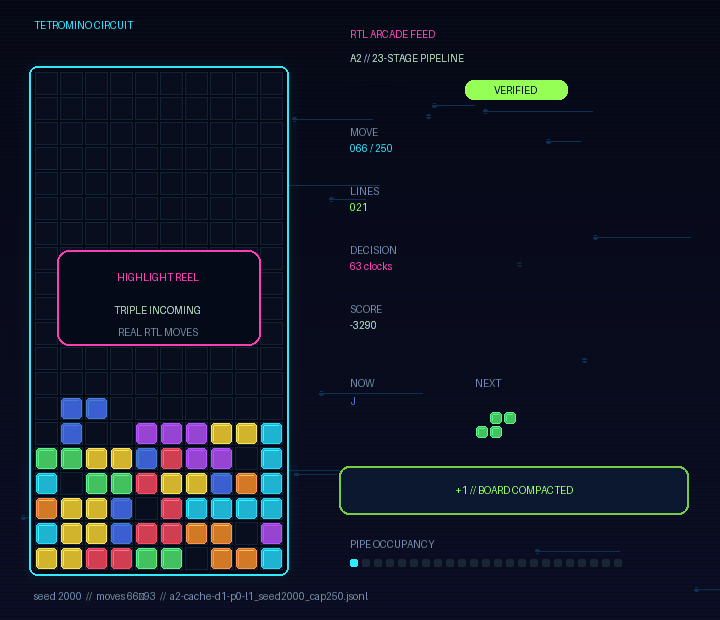
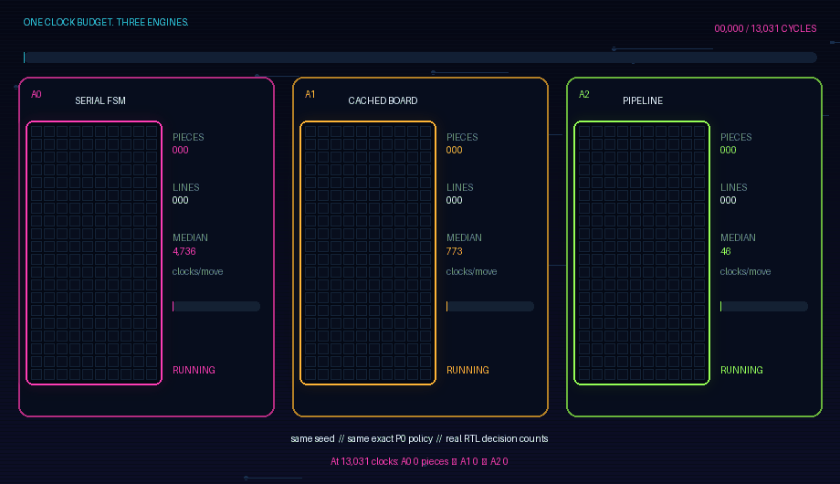
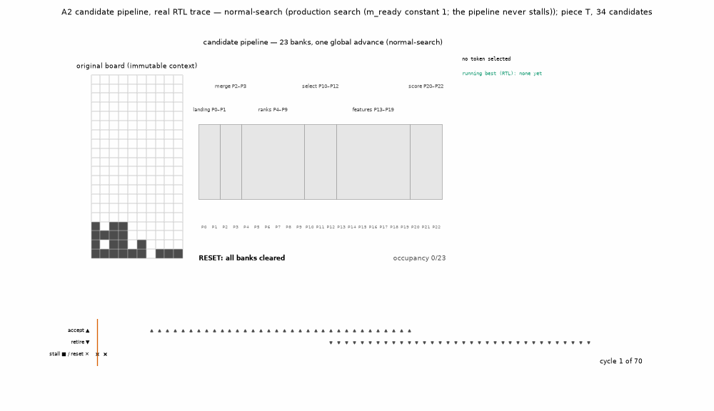

# Tetromino Circuit

Hiii :) I started this project for fun. I wanted to build a hardware circuit that plays a small
version of Tetris because search, caching, and pipelining sounded fun to explore.
The first version used one simple evaluator. Later versions added a cache, parallel lanes, and a
23-stage pipeline.

The game uses a compact, drop-only ruleset. Each piece gets one rotation and one column. It then
falls straight down. That narrow scope makes every legal move easy to enumerate. It also keeps the
SystemVerilog engine and the independent Python reference model directly comparable.

The repository includes three hardware architectures, real RTL replays, FPGA place-and-route
results, formal proofs, and a reproducible quality study. The saved evidence connects each result to
the source and toolchain that produced it.

## Game footage



This reel comes from the saved A2 RTL game for seed 2000. It covers moves 66 through 93 and includes
the triple-line clear at move 87. The renderer supplies the falling motion, color, and glow. Every
rotation, column, landing position, and cleared row comes from the circuit replay.



All three engines receive the same pieces and use the same exact P0 policy. Each gets 13,031
simulated clocks. A0 places 2 pieces. A1 places 12. The pipelined A2 reaches the 250-piece cap and
clears 95 lines.

Run `make render-showcase` to rebuild both GIFs from the committed replay files.

## Pipeline close-up



This animation follows one decision from the actual RTL trace. All 34 legal candidates enter the
23-stage pipeline at one candidate per cycle. They retire in order while the running winner changes.
The final response arrives 63 cycles after the request.

Open [`viewer/demo.html`](viewer/demo.html) to pause the trace and inspect individual pipeline stages.

## Results Summary

- A2 needs a median of 46 cycles per decision on the common 1,000-board corpus. Its latency follows
  `N + 29`, where `N` is the legal candidate count.
- The one-lane A1 evaluator needs a median of 773 cycles. A2 uses 17.1× fewer total cycles and
  selects the same move on all 1,000 boards.
- The three routed A2 seeds report 72.40 to 75.63 MHz. The design uses 6,104 LUT4s and 5,489
  flip-flops. Its LUT4 cost is 1.51× that of one A1 evaluator.
- The P1 powers-of-two policy reaches a restricted mean of 22,675 pieces. The study uses 100
  held-out streams capped at 50,000 pieces. P0 reaches 11,846. The paired difference is +10,828
  pieces with CI95 [7,082, 14,719].
- P5 keeps behavior close to P0 with 4-bit coefficients. P6 and P7 lose substantial playing quality.
  Those failures remain in the report.
- The verification suite covers 8,250 v1 decisions and 1,000 decisions per v2 configuration. The row
  compactor, reducer, and pipeline control have unbounded formal proofs. Twelve planted RTL bugs are
  caught by named tests.

The performance numbers come from RTL simulation and an FPGA device model.
They were not measured on a board.
Full tables are available in [`docs/results.md`](docs/results.md).

## Architecture

| Core | Design | Main idea |
|---|---|---|
| A0 | Sequential bitmap evaluator | Evaluate one candidate through the original datapath. |
| A1 | Cached evaluator | Reuse board features and support parallel evaluator lanes. |
| A2 | Candidate pipeline | Move one candidate per cycle through 23 registered stages. |

All three cores implement the same `drop-v1.1` contract. The score is
`76L − 51A − 36Q − 18U`. See [`docs/spec.md`](docs/spec.md) for the exact rules and tie-breaks.

## Repo Guide

| Topic | Files |
|---|---|
| Game rules | [`docs/spec.md`](docs/spec.md) |
| A0 and A1 | [`docs/design.md`](docs/design.md) |
| A2 pipeline | [`docs/design_a2.md`](docs/design_a2.md) |
| Research report | [`docs/research_report.md`](docs/research_report.md) |
| Detailed results | [`docs/results.md`](docs/results.md) |
| Quality study | [`docs/quality_v2.md`](docs/quality_v2.md) |
| Precision study | [`docs/precision_v2.md`](docs/precision_v2.md) |
| Replay format and viewer | [`docs/replay.md`](docs/replay.md) and [`viewer/`](viewer/) |
| Result identities | [`docs/identities.md`](docs/identities.md) |
| Verification | [`docs/verification_a2.md`](docs/verification_a2.md) |
| Toolchain and CI | [`docs/toolchain.md`](docs/toolchain.md) and [`docs/ci.md`](docs/ci.md) |
| Release status | [`docs/release_v2.md`](docs/release_v2.md) |
| Earlier v1 notes | [`docs/history/`](docs/history/README.md) |

## Software setup

Python 3.11 or 3.12 is required. The software checks take about a minute on a recent laptop.

```bash
python3 -m venv .venv
.venv/bin/pip install -r requirements.lock
.venv/bin/pip install --no-deps -e .
bash scripts/env.sh python -m pytest tests/unit -q
bash scripts/env.sh python tools/check_claims.py
bash scripts/env.sh python tools/check_trace.py
make check-writing
```

The saved pipeline demo opens directly in a browser.

```bash
open viewer/demo.html
```

For the file-loading viewer, serve the repository root. Then open `http://localhost:8000/viewer/`.

```bash
python3 -m http.server
```

## RTL setup

The bootstrap script installs the pinned YosysHQ OSS CAD Suite. The archive is about 740 MB and
expands to roughly 3 GB under `.tools/`.

```bash
bash scripts/bootstrap.sh
make doctor
make smoke
make test-core ARCH=2 BOARD_REPR=1 COUNT=50 DRIVER=native
```

Hardware configurations use `ARCH`, `BOARD_REPR`, `LANES`, `DEPTH`, and `PRECISION`. The supported
combinations are listed by this command:

```bash
bash scripts/env.sh python -m model.config --list
```

## Study reproduction

The full study is resumable. Job identities include the relevant source files, parameters, tool
versions, and constraints. Cached work is reused only when those inputs still match.

```bash
make verify-a2-release
make measure-v2 MODE=run
make bench-v2 MODE=run SUITE=bag50k
make analyze-quality-v2
make plots-v2
make results-v2
make check-report-v2
```

The hardware matrix contains 84 routes and 6,000 decisions. It took about 4.4 hours on two cores.
The held-out quality study contains 600 games. It took about 11 minutes in summary mode.

Use the dry-run modes to inspect the work before starting it:

```bash
make measure-v2 MODE=dry-run
make bench-v2 MODE=dry-run
```

Run `make help` for the complete command list.

## Evidence

Raw v2 jobs live under `results/v2/raw/`. Summary files live under `results/v2/summary/`. Command
logs and exit codes live under `results/evidence/`.

The validators reject stale identities, missing artifacts, incomplete matrices, and unsupported
release claims. Timeouts and failed timing runs remain visible in the published tables.

## Scope and limitations

- The `drop-v1.1` game uses straight drops (very simple, I know). Kicks, tucks, spins, hold, lock delay, gravity, hidden
  rows, combos, garbage, and multiplayer are excluded.
- Long quality runs use the bit-exact Python policy model. RTL decisions are checked against that
  model on shared corpora and saved replays.
- Cycle counts come from RTL simulation. Timing comes from nextpnr for an ECP5 LFE5U-85F device
  model with auto-allocated I/O.
- Board measurements and power measurements are outside the current study.
- A route timeout records an unfinished route at the declared time limit. Every timeout remains in
  the result set.
- The quality study compares fixed coefficient profiles. It does not search for optimal weights.

## References and license

The project uses the fixed four-feature heuristic from Yiyuan Lee, *Tetris AI: The (Near) Perfect
Bot* (2013). [`NOTICE.md`](NOTICE.md) contains the full credit and toolchain notices.

The hardware flow uses the YosysHQ OSS CAD Suite. It includes Yosys, nextpnr-ecp5, Verilator,
SymbiYosys, and Boolector. The suite is pinned to release 2026-09-04.

The target model is a Lattice ECP5 LFE5U-85F in a CABGA381 package with speed grade 6.

This repository is available under the MIT License. See [`LICENSE`](LICENSE).
