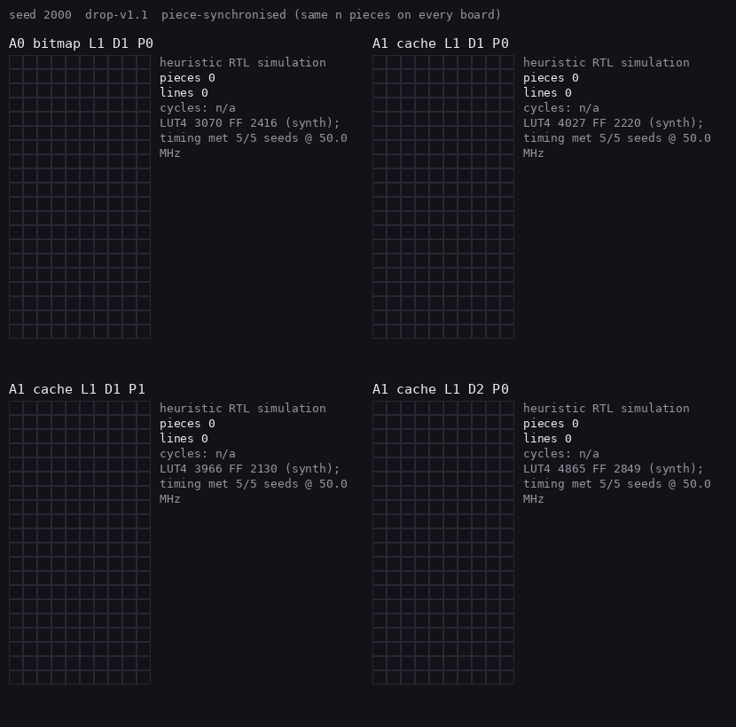

# tetromino-circuit

A **drop-only Tetris decision engine** in synthesizable SystemVerilog, and a study of how its
hardware organisation, arithmetic precision, and search depth change area, latency, and playing
strength. The game is the `drop-v1.1` contract in [`docs/spec.md`](docs/spec.md): a 10×20 board with
no hidden rows, a piece chooses an orientation and column *above* the board and drops straight down
(no lateral movement, hold, kicks, or timing), a placement is legal only if it lands entirely inside
the board, full rows are removed together, and the move with the best score
`76·L − 51·A − 36·Q − 18·U` (lines, aggregate height, holes, bumpiness) wins with ties to the lower
candidate id. The circuit receives a board and a piece, enumerates every allowed drop, evaluates the
resulting boards, and returns the best action. Everything here runs in RTL simulation (Verilator)
and is implemented against an ECP5 device model (Yosys + nextpnr); **no FPGA board was used and no
physical measurement is claimed.**



*Four circuit variants playing validation seed 2000 for 100 pieces, every board driven by the actual
RTL through the native Verilator driver and checked against the Python reference at each move.
Panels: A0 serial evaluator, A1 fast evaluator with a height cache, A1 with power-of-two
coefficients, A1 with two-piece lookahead. LUT/FF figures are static synthesis results for that exact
configuration. Piece-synchronised: every board shows the same number of pieces; exact variants match
move for move while policy variants diverge.*

<!-- results:start -->

### Three measured facts

**Verification.** 8,250 complete-core decisions across 9 hardware configurations match the Python literal-descent reference (`results/decisions/*.csv`), plus three 250-piece RTL games per depth-one configuration checked against Python at every move (`results/replays/`).

**Resources.** The fast exact engine with a height cache (`a1-cache-d1-p0-l1`) synthesizes to 4027 LUT4 and 2220 flip-flops on the ECP5 LFE5U-85F (Yosys `synth_ecp5`), with routed timing 5/5 met 50 MHz; Fmax 64.5–69.0 MHz (`results/implementation.csv`).

**Latency.** Median 773 core cycles per decision on the corpus (A0 serial: 4719), projecting to 15.5 µs per decision at the timing-supported 50 MHz constraint; this is RTL-simulation cycle count divided by a routed clock constraint, not measured on a board.

### Measured results (generated by `tools/write_report.py`; do not edit by hand)

Source: `results/implementation.csv` (45 routing attempts, 44 met timing; ECP5 LFE5U-85F CABGA381 speed 6, 50 MHz target, seeds 1–5), `results/decisions/` (native Verilator driver on the committed corpora), `results/quality_summary.json` (Python bit-exact policies on held-out streams). RTL hash `ae34d12e7803250b`, toolchain `oss-cad-suite-2026-09-04-8fb2384c2f88`.

| Configuration | LUT4 | FF | Routed timing (5 seeds) | Median cycles/decision | Max | Decisions checked |
|---|---:|---:|---|---:|---:|---|
| A0 serial, bitmap (`a0-bitmap-d1-p0-l1`) | 3070 | 2416 | 5/5 met 50 MHz; Fmax 62.6–68.5 MHz | 4719 | 9596 | 1000/1000 match |
| A1 fast, bitmap (`a1-bitmap-d1-p0-l1`) | 4108 | 2121 | 5/5 met 50 MHz; Fmax 65.6–68.6 MHz | 790 | 1572 | 1000/1000 match |
| A1 fast, height cache (`a1-cache-d1-p0-l1`) | 4027 | 2220 | 5/5 met 50 MHz; Fmax 64.5–69.0 MHz | 773 | 1538 | 1000/1000 match |
| A1 cache, P1 powers_of_two (`a1-cache-d1-p1-l1`) | 3966 | 2130 | 5/5 met 50 MHz; Fmax 66.2–69.3 MHz | 773 | 1538 | 1000/1000 match |
| A1 cache, P2 two_terms (`a1-cache-d1-p2-l1`) | 3999 | 2220 | 5/5 met 50 MHz; Fmax 66.5–68.3 MHz | 773 | 1538 | 1000/1000 match |
| A1 cache, P3 cap_holes (`a1-cache-d1-p3-l1`) | 4004 | 2216 | 5/5 met 50 MHz; Fmax 66.8–68.2 MHz | 773 | 1538 | 1000/1000 match |
| A1 cache, P4 no_bumpiness (`a1-cache-d1-p4-l1`) | 3942 | 2167 | 5/5 met 50 MHz; Fmax 65.8–67.2 MHz | 773 | 1538 | 1000/1000 match |
| A1 cache, depth 2 (`a1-cache-d2-p0-l1`) | 4865 | 2849 | 5/5 met 50 MHz; Fmax 64.5–67.2 MHz | 13522 | 52469 | 250/250 match |
| A1 cache, 2 lanes (`a1-cache-d1-p0-l2`) | 7453 | 3738 | 4/5 met 50 MHz; 1 did not converge; Fmax 63.8–66.0 MHz | 414 | 774 | 1000/1000 match |

Projected decision latency (median cycles ÷ 50 MHz; model-based, not measured on a board): A0 serial, bitmap: 4719 cycles = 94.4 µs at a timing-supported 50 MHz; A1 fast, height cache: 773 cycles = 15.5 µs at a timing-supported 50 MHz; A1 cache, 2 lanes: 414 cycles; projection withheld because not every route seed completed with timing met.

Held-out playing strength, precision study (`results/quality.csv`, experiment `precision`): streams 3000–3099, cap 2000 pieces, Python bit-exact policies backed by the RTL differential corpora above.

| Policy | Mean lines | Median | IQR | Cap-hit | Top-out | Mean pieces | Mean diff vs exact (95% paired bootstrap CI) | Corpus disagreement with exact |
|---|---:|---:|---|---:|---:|---:|---|---:|
| heuristic-d1-p0 | 752.6 | 796 | 792–797 | 87% | 13% | 1897 | baseline |  |
| heuristic-d1-p1 | 756.6 | 797 | 795–798 | 91% | 9% | 1904 | +4.04 [-37.20, +42.55] | 4.2% |
| heuristic-d1-p2 | 752.6 | 796 | 792–797 | 87% | 13% | 1897 | +0.00 [+0.00, +0.00] | 0.0% |
| heuristic-d1-p3 | 730.3 | 796 | 792–797 | 80% | 20% | 1842 | -22.33 [-52.04, +6.66] | 5.9% |
| heuristic-d1-p4 | 16.1 | 14 | 8–21 | 0% | 100% | 79 | -736.47 [-760.99, -707.82] | 43.6% |
| random_legal-d1-p0 | 0.1 | 0 | 0–0 | 0% | 100% | 26 | -752.51 [-777.25, -723.70] |  |

Depth study (`results/quality.csv`, experiment `depth`; predeclared smaller workload): streams 3000–3019, cap 500 pieces, exact profile, compare only within this table.

| Policy | Mean lines | Median | IQR | Cap-hit | Mean diff vs depth 1 (95% CI) | Median RTL cycles/decision |
|---|---:|---:|---|---:|---|---:|
| heuristic-d1-p0 | 195.3 | 196 | 194–199 | 95% | baseline | 773 |
| heuristic-d2-p0 | 198.5 | 199 | 198–199 | 100% | +3.15 [+1.40, +5.70] | 13522 |

Tournament (`results/tournament_report.json`): seed 2000, cap 100, actual RTL replays; lines A0 serial, bitmap 33, A1 fast, height cache 33, A1 cache, P1 powers_of_two 37, A1 cache, depth 2 37; first move differing from A0: A0 serial, bitmap never, A1 fast, height cache never, A1 cache, P1 powers_of_two 40, A1 cache, depth 2 2.

<!-- results:end -->

## Quickstart

Software only (Python 3.11/3.12, no HDL tools):

```bash
python3 -m venv .venv && .venv/bin/pip install -r requirements.lock && .venv/bin/pip install --no-deps -e .
.venv/bin/python -m pytest tests/unit -q                    # 300+ tests incl. the 40,500-case differential
.venv/bin/python tools/play.py --policy heuristic --seed 2000 --max-pieces 250 --out results/python_demo.jsonl
.venv/bin/python tools/render.py --replay results/python_demo.jsonl --out assets/python_demo.gif
```

Full flow (downloads the pinned OSS CAD Suite, about 740 MB, into `.tools/`):

```bash
bash scripts/bootstrap.sh              # idempotent: pinned suite 2026-09-04, venv, locks, toolchain.lock.json
make doctor && make smoke              # toolchain check; counter simulation + lint + synth_ecp5
make test-rtl                          # module and core tests (cocotb) plus a native differential subset
make demo-rtl                          # 250-piece RTL game, checked against Python at every move, rendered to a GIF
make synth ARCH=1 BOARD_REPR=1 && make pnr ARCH=1 BOARD_REPR=1 SEED=1
make reproduce                         # resumable orchestrator of the whole documented pipeline
```

`make help` lists every target. Configurations are selected with `ARCH` (0 serial, 1 fast),
`BOARD_REPR` (0 bitmap, 1 bitmap + height cache), `LANES` (1, 2), `DEPTH` (1, 2) and `PRECISION`
(0–4); only the nine verified combinations are accepted (`model/config.py`, `tetris_core.sv`).

## Hardware blocks

| Block | File | Responsibility |
|---|---|---|
| Shape ROM | `rtl/shape_rom.sv` (+ generated `rtl/generated/shape_case.svh`) | Piece + rotation → four cells, width, height, per-column bottom offsets, occupied-column mask |
| Candidate list | `rtl/cand_rom.sv` | Dense list of valid candidate ids per piece (17, 9, 34, 17, 17, 34, 34) in increasing id order |
| A0 drop / merge / features | `drop_unit.sv`, `merge_unit.sv`, `features.sv` | Literal descent from y = 20 one row per cycle; one cell written per cycle; 200-cell scan then a ten-cycle reduction |
| A1 profile / drop / merge / features | `board_profile.sv`, `drop_fast.sv`, `merge_fast.sv`, `features_fast.sv` | Ten parallel priority encoders; two-stage closed-form landing; one-hot mask merge; popcount and adder trees (saturating tree for P3, no U path for P4) |
| Compactor | `rtl/line_clear.sv` | Twenty-iteration row scan with no indexed access (shift in, push survivors), 0–20 clears |
| Scorer | `rtl/score.sv` | Registered `wL·L − wA·A − wQ·Q − wU·U`; exact profile as shift-add (no DSP); profiles 1–4 as declared structures |
| Candidate evaluator | `rtl/candidate_eval.sv` | start/busy/done FSM sequencing the blocks; identical boundary for A0 and A1 |
| Lane player | `rtl/lane_player.sv` | Owns dense indices `k, k+LANES, …`; private evaluator and local best |
| Depth-two search | `rtl/search_depth2.sv` | Nested controller around one evaluator with a copied B1 board and B1 height cache |
| Core | `rtl/tetris_core.sv` | Ready/valid request/response, height cache, lane reduction, error/no-move paths, latency counter |
| Streaming wrapper | `rtl/stream_wrapper.sv` | 8-word request / 3-word response 32-bit streams for place-and-route |

## Verification

The Python oracle uses literal cell-by-cell descent (`model/game.py`) and a second, independent
set-of-cells implementation (`tests/reference_grid.py`); the accelerated column-bitmask model
(`model/fast.py`) that uses the closed-form landing is only trusted because it agrees with both on
40,500 candidate cases (250 boards × 162 candidates) and on every policy decision in the unit tests.
RTL is tested bottom-up with cocotb: every ROM input; scorer boundaries plus 1,000 tuples per profile
(a mutated coefficient or coordinate makes the tests fail); the drop unit on 8,100 candidates
including the high-overhang regression; merge, compactor (0–20 clears) and feature units on
generated and one-hot boards; the evaluator on 16,200 candidates with every intermediate value
compared (landing, merged board, cleared board, features, lines, score); the core on the
1,000-request corpus (`benchmarks/states/corpus_d1.jsonl`: trajectory, random-play, high-stack, and
structured edge cases) and the 250-case depth-two corpus; protocol tests for held valid, busy-time
input changes, stalls of 1/3/17/100 cycles, requests while busy, reset in every major state, piece 7,
and preview independence at depth one; the wrapper with pauses on every word, reset mid-packet and
back-to-back packets. The persistent C++ Verilator driver (`sim/main.cpp`) agrees with cocotb on
every response field and cycle count and runs full games with each move checked against Python.
Evidence for every job E00–E19 is in `results/evidence/`.

## Experiments

Exact variants (A0 → A1 → height cache → two lanes) must and do preserve every decision; they
trade area for cycles. The numerical profiles (`PRECISION` 0–4) and the depth-two search change
decisions and are measured against their own bit-exact references, then compared on held-out streams
(`benchmarks/config.json` was frozen before any test-split outcome was inspected). The figures in
`assets/plots/` are rebuilt from the committed CSV/JSON by `make plots`; the analysis is in
[`docs/design.md`](docs/design.md).

## Limitations

* The game is a simplification: no kicks, tucks, hold, gravity timing, or hidden rows; scores are not
  comparable to published workers playing other rules.
* Playing-strength numbers come from the Python bit-exact policy model, backed by RTL differential
  corpora and short full-RTL games; they are labelled as such wherever they appear.
* Cycle counts are RTL-simulation counts under the documented protocol; latency projections divide
  them by a *routed* clock constraint on a device model with auto-allocated I/O. Nothing was measured
  on a board, and no power figure is given.
* A1 reuses the twenty-iteration compactor, so it evaluates one candidate at a time (no initiation
  interval of one). An overlapped pipeline (A2) is a separately scoped extension.
* The heuristic coefficients are an attributed baseline (Lee, 2013), not tuned or optimal.

## Roadmap (not implemented)

A2 overlapped candidate pipeline with a parallel compactor; K-budget candidate truncation; lossless
height-plus-hole-mask storage; weight learning on training streams; a Hardcaml port of the scorer.

## References

* Yiyuan Lee, *Tetris AI – The (Near) Perfect Bot* (2013) — the four-feature heuristic and starting coefficients.
* I. Szita and A. Lőrincz, *Learning Tetris Using the Noisy Cross-Entropy Method*, Neural Computation 18 (2006) — prior work on learned Tetris evaluation functions under different rules.
* YosysHQ OSS CAD Suite (Yosys, nextpnr-ecp5, Verilator), cocotb 2.0.1 — tools; versions in `toolchain.lock.json`.
* Build manual and audit history: `docs/BUILD_MANUAL.md`, `docs/bugs.md`, `docs/PROBLEMS_FOUND.md`.
