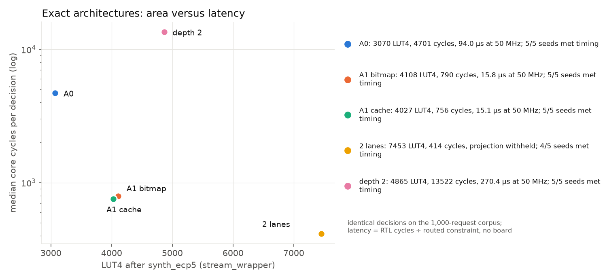
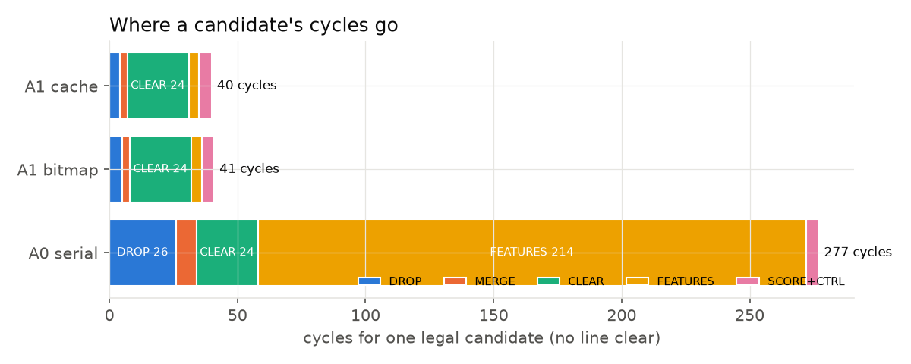
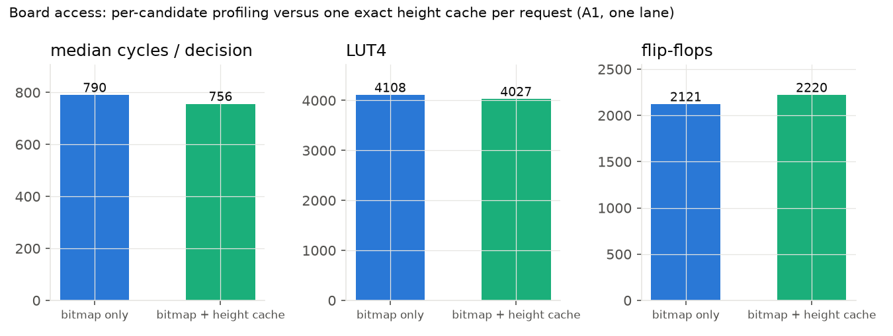
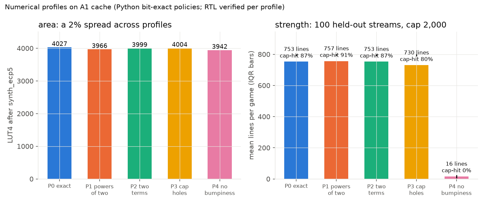
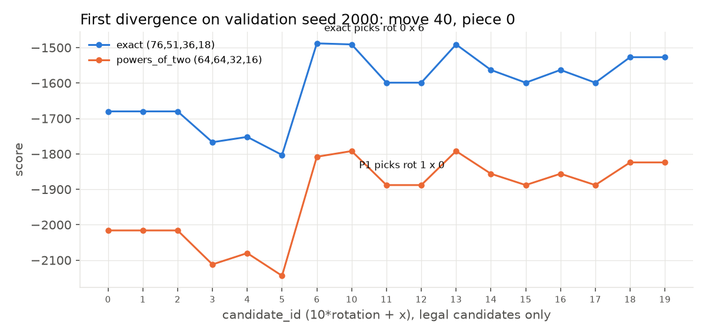
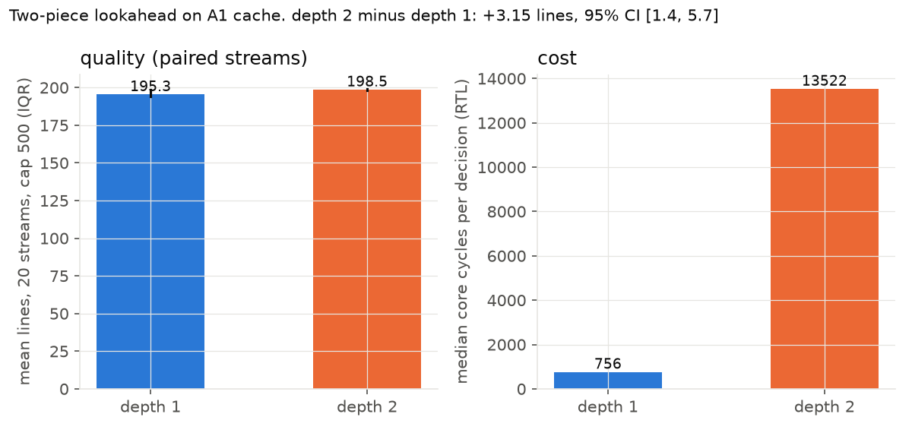

# A small architecture study of a drop-only Tetris decision engine

## 1. Research questions

A Tetris decision is a bounded search: at most 34 candidate placements, each requiring a landing
check, a merge, a line clear, feature extraction and a score. That is small enough to build several
complete hardware organisations of it and measure them honestly, and rich enough that the
organisation matters. The study asks four questions with one game, one heuristic and one toolchain
held fixed:

1. **Datapath organisation.** How do area and latency change between a sequential evaluator that
   reuses one bit-serial datapath (A0) and a parallel evaluator (A1) that computes heights, landing,
   merge and features in a few cycles — while producing *identical decisions*?
2. **Board access.** Does caching the exact column heights of the request board once per decision
   (rather than deriving them for every candidate) change latency or area, again with identical
   decisions?
3. **Arithmetic.** When the heuristic's coefficients are quantised to shifts, or a scoring feature
   is saturated or removed, how much logic is actually saved and how much playing strength is lost?
4. **Search.** What does a second piece of lookahead cost in cycles and hardware, and does it help
   under this heuristic on finite streams?

Exact variants (questions 1, 2 and the two-lane replication) must preserve every decision, so their
comparison is purely area versus cycles. Questions 3 and 4 change the policy, so each variant is
verified against its *own* bit-exact reference and then compared on held-out piece streams.

## 2. The game, the variants, and the data

**Game.** `drop-v1.1` (`docs/spec.md`): 10×20 board, no hidden rows, seven pieces with 2/1/4/2/2/4/4
geometric orientations (162 candidates over all pieces, at most 34 per decision), entry from above
the board with a straight drop, legality = the landed piece lies inside rows 0–19, simultaneous
clear of full rows, post-clear features A (aggregate height), Q (holes), U (bumpiness), score
`76L − 51A − 36Q − 18U` (coefficients from Lee, 2013), ties to the lower `candidate_id = 10·rotation + x`.
The entry-from-above rule replaced an earlier inside-board spawn that let a piece appear beneath an
overhang (Section 7).

**Hardware variants** (all behind the same ready/valid core interface and the same 32-bit streaming
wrapper used for implementation):

| Id | ARCH | Board | Lanes | Depth | Precision | What changes |
|---|---|---|---|---|---|---|
| `a0-bitmap-d1-p0-l1` | A0 | bitmap | 1 | 1 | exact | descent one row/cycle, one cell merged/cycle, 200-cell feature scan |
| `a1-bitmap-d1-p0-l1` | A1 | bitmap | 1 | 1 | exact | ten parallel priority encoders per candidate, closed-form landing (two stages), one-hot mask merge, popcount/adder trees; reused 20-iteration compactor |
| `a1-cache-d1-p0-l1` | A1 | + height cache | 1 | 1 | exact | request-board heights derived once per decision |
| `a1-cache-d1-p{1..4}-l1` | A1 | cache | 1 | 1 | P1–P4 | shift coefficients (64,64,32,16); two-term coefficients (80,48,36,18); Q saturated at 15 through a four-bit saturating tree; U datapath removed |
| `a1-cache-d2-p0-l1` | A1 | cache | 1 | 2 | exact | nested search: for each legal root, copy B1, build its cache, evaluate every leaf |
| `a1-cache-d1-p0-l2` | A1 | cache | 2 | 1 | exact | two evaluators on dense indices k, k+2, …; local bests reduced deterministically |

**Data.** Piece streams are committed seven-bag lists of 2,001 pieces: training seeds 1000–1049,
validation 2000–2019, test 3000–3099. The decision corpus (`benchmarks/states/corpus_d1.jsonl`) has
1,000 states: 300 from exact-policy trajectories, 300 from random-play trajectories, 200 generated
high-stack/hole boards (labelled potentially unreachable), and 200 structured cases (walls, wells,
blocked spawns, equal scores, last-candidate winners, no-move). The depth-two corpus has 250 cases
including root ties, all-terminal fallback, no current move, differing previews and late winning roots.
`benchmarks/config.json` froze caps, seeds, policies and the hardware matrix before any test-split
result was looked at; the validation pilot predicted that exact policies would reach the 2,000-piece
cap on most streams, so cap-hit fraction and lines-at-cap were declared primary statistics in advance.

## 3. Measurement method

*Decision cycles.* The core counts rising edges from the acceptance edge (`req_valid && req_ready`)
to the first registered `rsp_valid`; the counter freezes during output stalls. Every value reported is
`cycles_o` from RTL simulation, cross-checked against an independent edge count in both the cocotb
and the native Verilator drivers. Per-stage attributions come from tracing the evaluator FSM
(`results/stage_cycles_*.json`).

*Area and timing.* Yosys `synth_ecp5` on the streaming wrapper (LUT4, flip-flops, carry cells, BRAM,
DSP), then nextpnr-ecp5 for LFE5U-85F, CABGA381, speed grade 6 with a 50 MHz constraint and
auto-allocated I/O, five route seeds per configuration. A configuration "meets timing" only if the
router's own report says PASS; the achieved Fmax is reported as a range over seeds, never a single
best seed. Projected latency = median cycles ÷ 50 MHz and is stated only where every seed met the
constraint. These are device-model results; there is no board.

*Playing strength.* Games are played by the Python column-bitmask model, which is bit-exact with
the RTL policy (it agrees with the literal-descent reference on 40,500 candidate cases and with the
RTL on the 1,000-request corpus per configuration and on 250-piece RTL games). The precision study
plays profiles P0–P4 and a random baseline on 100 held-out streams with a 2,000-piece cap; the depth
study plays depth 1 and 2 on 20 held-out streams with a 500-piece cap (a predeclared smaller workload
because the search is ~34× larger). Mean-line differences carry 95% paired bootstrap intervals from
2,000 resamples of stream ids drawn jointly across compared policies; moves within a game are not
treated as independent. A game that reaches its cap is `cap_reached`, not a failure at that piece.

<!-- results:start -->

### Three measured facts

**Verification.** 8,250 complete-core decisions across 9 hardware configurations match the Python literal-descent reference (`results/decisions/*.csv`), plus three 250-piece RTL games per depth-one configuration checked against Python at every move (`results/replays/`).

**Resources.** The fast exact engine with a height cache (`a1-cache-d1-p0-l1`) synthesizes to 4027 LUT4 and 2220 flip-flops on the ECP5 LFE5U-85F (Yosys `synth_ecp5`), with routed timing 5/5 met 50 MHz; Fmax 64.5–69.0 MHz (`results/implementation.csv`).

**Latency.** Median 773 core cycles per decision on the corpus (A0 serial: 4719), projecting to 15.5 µs per decision at the timing-supported 50 MHz constraint; this is RTL-simulation cycle count divided by a routed clock constraint, not measured on a board.

### Measured results (generated by `tools/write_report.py`; do not edit by hand)

Source: `results/implementation.csv` (45 routing attempts, 44 met timing; ECP5 LFE5U-85F CABGA381 speed 6, 50 MHz target, seeds 1–5), `results/decisions/` (native Verilator driver on the committed corpora), `results/quality_summary.json` (Python bit-exact policies on held-out streams). RTL hash `ae34d12e7803250b`, toolchain `oss-cad-suite-2026-09-04-8fb2384c2f88`.

| Configuration | LUT4 | FF | Routed timing (5 seeds) | Median cycles/decision | Max | Decisions checked |
|---|---:|---:|---|---:|---:|---|
| A0 serial, bitmap (`a0-bitmap-d1-p0-l1`) | 3070 | 2416 | 5/5 met 50 MHz; Fmax 62.6–68.5 MHz | 4719 | 9596 | 1000/1000 match |
| A1 fast, bitmap (`a1-bitmap-d1-p0-l1`) | 4108 | 2121 | 5/5 met 50 MHz; Fmax 65.6–68.6 MHz | 790 | 1572 | 1000/1000 match |
| A1 fast, height cache (`a1-cache-d1-p0-l1`) | 4027 | 2220 | 5/5 met 50 MHz; Fmax 64.5–69.0 MHz | 773 | 1538 | 1000/1000 match |
| A1 cache, P1 powers_of_two (`a1-cache-d1-p1-l1`) | 3966 | 2130 | 5/5 met 50 MHz; Fmax 66.2–69.3 MHz | 773 | 1538 | 1000/1000 match |
| A1 cache, P2 two_terms (`a1-cache-d1-p2-l1`) | 3999 | 2220 | 5/5 met 50 MHz; Fmax 66.5–68.3 MHz | 773 | 1538 | 1000/1000 match |
| A1 cache, P3 cap_holes (`a1-cache-d1-p3-l1`) | 4004 | 2216 | 5/5 met 50 MHz; Fmax 66.8–68.2 MHz | 773 | 1538 | 1000/1000 match |
| A1 cache, P4 no_bumpiness (`a1-cache-d1-p4-l1`) | 3942 | 2167 | 5/5 met 50 MHz; Fmax 65.8–67.2 MHz | 773 | 1538 | 1000/1000 match |
| A1 cache, depth 2 (`a1-cache-d2-p0-l1`) | 4865 | 2849 | 5/5 met 50 MHz; Fmax 64.5–67.2 MHz | 13522 | 52469 | 250/250 match |
| A1 cache, 2 lanes (`a1-cache-d1-p0-l2`) | 7453 | 3738 | 4/5 met 50 MHz; 1 did not converge; Fmax 63.8–66.0 MHz | 414 | 774 | 1000/1000 match |

Projected decision latency (median cycles ÷ 50 MHz; model-based, not measured on a board): A0 serial, bitmap: 4719 cycles = 94.4 µs at a timing-supported 50 MHz; A1 fast, height cache: 773 cycles = 15.5 µs at a timing-supported 50 MHz; A1 cache, 2 lanes: 414 cycles; projection withheld because not every route seed completed with timing met.

Held-out playing strength, precision study (`results/quality.csv`, experiment `precision`): streams 3000–3099, cap 2000 pieces, Python bit-exact policies backed by the RTL differential corpora above.

| Policy | Mean lines | Median | IQR | Cap-hit | Top-out | Mean pieces | Mean diff vs exact (95% paired bootstrap CI) | Corpus disagreement with exact |
|---|---:|---:|---|---:|---:|---:|---|---:|
| heuristic-d1-p0 | 752.6 | 796 | 792–797 | 87% | 13% | 1897 | baseline |  |
| heuristic-d1-p1 | 756.6 | 797 | 795–798 | 91% | 9% | 1904 | +4.04 [-37.20, +42.55] | 4.2% |
| heuristic-d1-p2 | 752.6 | 796 | 792–797 | 87% | 13% | 1897 | +0.00 [+0.00, +0.00] | 0.0% |
| heuristic-d1-p3 | 730.3 | 796 | 792–797 | 80% | 20% | 1842 | -22.33 [-52.04, +6.66] | 5.9% |
| heuristic-d1-p4 | 16.1 | 14 | 8–21 | 0% | 100% | 79 | -736.47 [-760.99, -707.82] | 43.6% |
| random_legal-d1-p0 | 0.1 | 0 | 0–0 | 0% | 100% | 26 | -752.51 [-777.25, -723.70] |  |

Depth study (`results/quality.csv`, experiment `depth`; predeclared smaller workload): streams 3000–3019, cap 500 pieces, exact profile, compare only within this table.

| Policy | Mean lines | Median | IQR | Cap-hit | Mean diff vs depth 1 (95% CI) | Median RTL cycles/decision |
|---|---:|---:|---|---:|---|---:|
| heuristic-d1-p0 | 195.3 | 196 | 194–199 | 95% | baseline | 773 |
| heuristic-d2-p0 | 198.5 | 199 | 198–199 | 100% | +3.15 [+1.40, +5.70] | 13522 |

Tournament (`results/tournament_report.json`): seed 2000, cap 100, actual RTL replays; lines A0 serial, bitmap 33, A1 fast, height cache 33, A1 cache, P1 powers_of_two 37, A1 cache, depth 2 37; first move differing from A0: A0 serial, bitmap never, A1 fast, height cache never, A1 cache, P1 powers_of_two 40, A1 cache, depth 2 2.

<!-- results:end -->

## 4. Results by axis

### 4.1 Datapath organisation: A0 versus A1

A0 spends 277 cycles on a legal candidate: 25 in the row-by-row descent, 7 in the four-cell merge,
23 in the compactor, and 213 in the one-cell-per-cycle feature scan. Moving the feature extraction to
ten parallel priority encoders with popcount and adder trees, the landing to the closed form from
exact heights, and the merge to a one-hot mask brings a candidate to 39–40 cycles, of which 23 are
the *unchanged* compactor. That is the shape of the curve: the first parallelisation removes 85% of
the cycles for roughly a third more LUT4s (the decoders, encoders and trees replace multiplexers
and counters), and after it the reused compactor is 58% of what remains. A1 therefore cannot go
much further without redesigning the clear step, and it evaluates one candidate at a time: it is
not, and is not reported as, a pipeline with initiation interval one.

Two lanes double the evaluator and lane state and give a 1.87× speed-up for 1.85× the LUT4s — close
to linear because the dense candidate list splits the geometric candidates to within one and the
per-candidate latency is nearly constant. Both lanes' local winners are reduced in a separate state
with the global candidate-id tie-break; 53 corpus states had equal-score winners split across lanes
and all decisions were identical to one lane.

### 4.2 Board access: bitmap only versus exact height cache

With the bitmap alone, A1 profiles the latched request board in a dedicated cycle for every candidate
(the PROFILE state); with the cache, the core profiles the board once after acceptance and broadcasts
fifty height bits to the lane. The measured difference is exactly what the FSM predicts: one cycle per
candidate saved against one cycle per request added — a median of 17 cycles per decision on the
corpus (about 2%) — with the profile logic moving from inside the lane to the core and fifty extra
flip-flops. Heights are lossy, so the cache can only replace the input-board profile that the landing
formula needs; merge, clear and post-clear features still run on the bitmap, and the post-clear board
is profiled again by the feature unit. The interesting version of this experiment is with more lanes,
where one shared cache replaces one profile per lane.

### 4.3 Arithmetic: coefficient quantisation and feature reduction

Every profile is a structurally different scorer and feature unit, verified against its own
reference (scorer boundaries and 1,000 tuples, the parallel feature unit, 16,200 evaluator
candidates, 250 complete-core requests). Two results stand out. First, the area differences are
small — a spread of about 2% of LUT4s across all five profiles — because the scorer is a tiny part of a
design dominated by board storage, the compactor, and the merge mask; the manual's warning that
"a change in coefficients does not guarantee fewer LUTs" is confirmed by measurement. The one place
arithmetic *did* matter was the multiplier form of the exact scorer, which Yosys mapped to DSP slices
(4 for the scorer alone, 12 with the index multiplies) until it was rewritten as shift-add; that is a
tooling effect, not a precision effect, and it is recorded separately. Second, playing strength is
insensitive to the coefficient quantisations: powers-of-two and two-term profiles are statistically
indistinguishable from exact on 100 held-out streams (the two-term profile chose the *same* move as
exact on every decision of every game), capping holes at 15 costs a little, and removing bumpiness
destroys play. Bumpiness is the feature that keeps the surface flat enough for the next piece; the
divergence figure shows the first move on seed 2000 where the power-of-two profile prefers a placement
the exact profile ranks lower, and both trajectories are rendered in `assets/divergence_p0_vs_p1.gif`.

### 4.4 Search: depth one versus depth two

Depth two multiplies the work by the number of legal leaves per root: the corpus median is about
13,500 cycles and the worst case 52,469, against a derived FSM bound of about 52,700
(34 roots × (44 + 1 cache + 34 leaves × 44)). Hardware cost is the B1 board and cache registers and the
controller: about 20% more LUT4s and 28% more flip-flops than depth one. On the 20-stream, 500-piece
paired study the lookahead improves lines by a small but statistically positive amount, mostly by
avoiding the few early top-outs that cap censoring otherwise hides; the manual was right that the
improvement is not guaranteed under this heuristic, and the size of the effect is bounded by the cap.

## 5. Why the curves bend

The cycle curve bends at the compactor because it is the one step whose parallel form is a genuinely
different structure (a prefix-rank selection network or twenty registered stages) rather than a wider
version of the sequential one; everything else — heights, landing, merge, features — has a
combinational form of modest depth. The area curve is flat across arithmetic profiles because the
state (200-bit boards in the core, each lane, the merge, the compactor and the depth-two branch) and
the wide multiplexers dominate; the arithmetic is a rounding error, and changing it only moves
decisions, not resources. Lanes scale almost linearly in both cycles and area because there is no
shared resource between them except the candidate list and the final reduction. Caching helps by
exactly the per-candidate work it removes and no more, which for one lane is one cycle.

## 6. Limitations

The game omits kicks, tucks, hold and gravity timing, and has no hidden rows; its scores do not
transfer to other rule sets. Playing-strength numbers are from the bit-exact Python model, not from
2,000-piece RTL games (RTL games are 250 pieces at depth one and 100 at depth two, checked move by
move). Timing results are for one device model, one speed grade, one constraint and five seeds, with
unconstrained I/O; there is no board, no I/O timing, and no power estimate. The two-lane result is
one point; four lanes and the overlapped A2 pipeline were left out of scope.

## 7. One real bug

The first specification put the piece *inside* the board at `y = 20 − height` and then descended.
Nothing in a 40,500-case cross-check between two Python implementations caught it, because both
shared the rule. A random-board audit found 806 cases in 570,000 where a J in rotation 3 (a three-tall
bar with a one-cell nub) appeared with its nub beneath an overhang and slid down through space that
a falling piece could never have reached. The fix — entry from y = 20 with above-board cells treated
as empty and a final in-board check — made the landing height a closed form of the column heights,
which in turn made the A1 drop unit a two-stage arithmetic block instead of a twenty-iteration
search. The regression fixture `spawn_under_overhang_J` and a separate set-of-cells oracle now guard
the rule; `docs/bugs.md` lists the other six.

## Appendix: handshake and verification evidence

Core protocol (`tetris_core.sv`): accept only on `req_valid && req_ready`; latch board, piece and
preview; `req_ready` low while computing or while a response is pending; response fields held until
`rsp_valid && rsp_ready`; return to accepting on the following cycle; synchronous reset cancels
in-flight work and pending responses. `tb/tb_protocol.py` covers held valid (accepted exactly once),
inputs changed while busy, stalls of 1/3/17/100 cycles, a second request during busy, resets at six
points including a pending response, piece 7, preview independence and the edge counter under stall.
Every job's commands, exit codes, elapsed times and test counts are in `results/evidence/E00`–`E19`.
