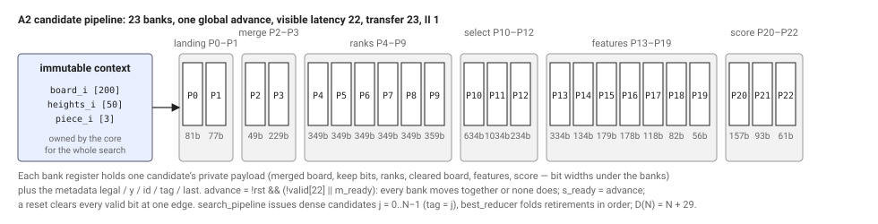
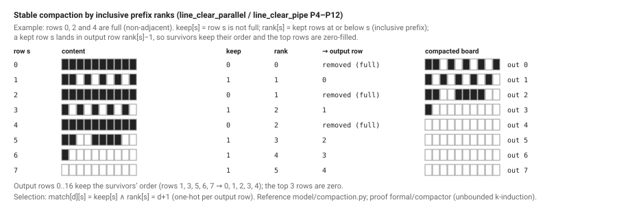

# A2 candidate pipeline — implementation specification (U04)

Status: **implemented and verified at the core level (U10)**; the U04 revision of this document
declared `Config(2, 1, 1, 1, 0)` (`a2-cache-d1-p0-l1`) without sources. Since U10 the configuration
is in `SUPPORTED`, `tetris_core`'s `CFG_OK` admits exactly `ARCH == 2 && BOARD_REPR == 1 &&
LANES == 1 && DEPTH == 1 && PRECISION == 0`, and the measured latencies (§8) are recorded from RTL.
Routing (U12) and the release matrix (U17) are separate evidence.

This document restates guide §4–§7 with the exact names used in this repository. The register
schedule lives in `architecture/a2_stages.json`; the cycle contract is executable in
`model/a2_token_model.py`; `make check-a2-spec` checks the three against each other.

## 1. Contracts that remain authoritative

* Board: 10 × 20, row 0 at the bottom, bit `10*y + x` of the 200-bit `board` is cell `(x, y)`;
  row `y` is `board[10*y +: 10]`, row 19 is `board[199:190]` (`rtl/line_clear.sv`,
  `rtl/board_profile.sv`: `col[y] = board_i[10*y + c]`, `model/board.py::pack_rows`). Complete-core
  inputs contain no full rows; the compactor modules accept any rows including twenty full rows.
* Geometry: `rtl/shape_rom.sv` (generated `rtl/generated/shape_case.svh` from `model/pieces.py`)
  gives `dx_o/dy_o` (cell `k` at `[2k +: 2]`), `width_o`, `height_o`, `bottom_o` (`bottom[dx]` at
  `[2dx +: 2]`, the smallest `dy` in bounding-box column `dx`), `colmask_o` (bit `dx` set when the
  column is occupied) and `valid_o`. `rtl/cand_rom.sv` maps `(piece, dense index)` to
  `candidate_id = 10*rotation + x` in increasing order; counts 17, 9, 34, 17, 17, 34, 34.
* Landing (drop-v1.1, `model/game.py::drop_y`, `rtl/drop_fast.sv`):
  `y_land = max(0, max over occupied dx of heights[x+dx] − bottom[dx])`,
  `legal = shape valid && x + width <= 10 && y_land + height <= 20`. Differences are signed
  seven-bit; unoccupied columns contribute −1; no packed index is formed from an out-of-range
  column (`hsel = (col <= 9) ? heights[5*col +: 5] : 0`).
* Post-clear features (`model/features.py`): `A = Σ heights`, `Q = holes below column tops`,
  `U = Σ |h[c] − h[c−1]|`, `S = 76L − 51A − 36Q − 18U`; bounds for a legal placement
  `L ≤ 4, A ≤ 200, Q ≤ 190, U ≤ 180`; score range `[−20640, 304]`.
* Winner: maximize signed score, then minimize `candidate_id`. The public core stays
  single-outstanding: it latches `board_q/piece_q/next_q` in `IDLE`, registers `heights_q` in
  `CACHE`, asserts registered `search_start` in `SEARCH_START`, waits in `SEARCH_WAIT`, reduces lane
  slots in `REDUCE`, latches the response in `FINALIZE`, holds it in `RESPOND` until `rsp_ready`,
  and cancels in-flight work on synchronous reset. Piece 7 takes the existing error path; at depth
  one the preview is ignored.

## 2. Integration (`rtl/tetris_core.sv`)

A third search branch is generated before the existing ones:

```systemverilog
if (ARCH == 2) begin : g_a2
    search_pipeline u_search (.clk, .rst, .start_i(search_start), .board_i(board_q), .heights_i(heights_q),
                              .piece_i(piece_q), .count_i(count), .busy_o(), .done_o(lane_done[0]),
                              .best_valid_o(lane_best_valid[0]), .best_score_o(lane_score[0]),
                              .best_id_o(lane_id[0]), .best_y_o(lane_y[0]), .issued_o(), .retired_o());
    assign s_done = 1'b0; ...          // depth-two outputs idle, as in g_d1
end else if (DEPTH == 1) begin : g_d1  // existing lane_player array, unchanged
end else begin : g_d2                  // existing search_depth2, unchanged
```

A2 is validated with one lane, so its result occupies lane slot 0 and the existing
`SEARCH_WAIT → REDUCE → FINALIZE → RESPOND` path is reused verbatim (`REDUCE` visits one slot).
`CFG_OK` gains exactly `ARCH == 2 && BOARD_REPR == 1 && LANES == 1 && DEPTH == 1 && PRECISION == 0`
in U10; A2 with the bitmap representation, depth two, several lanes or an approximate profile
fails in `model/config.py` (`validate`) and in elaboration (`$error`). `rtl/files.f` and
`rtl/files_core.f` gain, in dependency order, `rank_level.sv`, `row_rank20.sv`, `rank_match.sv`,
`row_select_groups.sv`, `row_select_final.sv`, `drop_merge_pipe.sv`, `line_clear_pipe.sv`,
`features_pipe.sv`, `score_pipe.sv`, `candidate_pipe.sv`, `search_pipeline.sv` before
`tetris_core.sv` (`line_clear_parallel.sv` is the combinational reference used by the formal miter
and the native harness, not a production file). The Makefile derives
`CFG_ID` from `python -m model.config` so `a2-cache-d1-p0-l1` is spelled by the same code as
every other id.

## 3. Context ownership (author's explanation)

One request owns one immutable context: `board_q`, `piece_q` and `heights_q` are written only in
`IDLE`/`CACHE` and the core cannot accept another request until the response has been consumed
(`req_ready = state == IDLE`). Everything the pipeline reads from outside a token — the original
heights at P0, the original board at P3 — therefore comes from a context that cannot change while
any token of that search is in flight. From P3 onward each token carries its own private merged
board, so no token ever reads another token's temporary board and the compactor and feature stages
need no context at all. This is why a single context register is sufficient: the hazard "a new
board arrives while old candidates are still in the pipe" cannot occur by construction, and the
tests make it observable by changing the public `board_i/piece_i/next_piece_i` inputs while a
request is latched (V12) and by asserting in the search controller that `start_i` is only accepted
when idle and the pipeline is empty (`issued == retired`). A trace-only request counter
distinguishes requests and resets in the simulator; the candidate `s_tag` carries the dense index.

## 4. Candidate token interface (`rtl/candidate_pipe.sv`)

| Port | Width | Meaning |
|---|---:|---|
| `clk`, `rst` | 1 | synchronous; reset clears every valid bit with priority over `advance` |
| `ctx_board_i` | 200 | original board, stable while any token is in flight |
| `ctx_heights_i` | 50 | ten 5-bit original heights (`heights_q`) |
| `ctx_piece_i` | 3 | current piece |
| `s_valid`, `s_ready` | 1 | candidate request handshake; `s_ready = advance` |
| `s_rotation`, `s_x` | 2, 4 | geometric candidate |
| `s_candidate_id` | 6 | `10*rotation + x`, the tie-break key |
| `s_tag` | 16 | opaque alignment tag (dense index in the core; unused high bits optimize away) |
| `s_last` | 1 | final enumerated candidate of this search |
| `m_valid`, `m_ready` | 1 | result handshake; `m_valid = valid[22] && !rst` |
| `m_legal`, `m_last` | 1 | legality; carried end marker |
| `m_candidate_id`, `m_tag` | 6, 16 | unchanged metadata |
| `m_y` | 5 | landing row of a legal candidate, else 0 |
| `m_score` | signed 32 | exact P0 score of a legal candidate, else 0 |

Every accepted candidate produces exactly one result token unless reset cancels it. Illegal
candidates occupy a token, carry `last`, are canonicalized to `y = 0, score = 0, legal = 0`, and do
not compete. A bubble is `valid = 0`; an illegal result is `valid = 1, legal = 0`. Diagnostic
values (merged board, compacted board, clear count, A/Q/U, per-bank tags) are exposed only through
a separate wrapper (`rtl/candidate_pipe_diag.sv`, diagnostic file list) or hierarchy access, never
as production pins.

## 5. Global advance

```systemverilog
assign advance = !rst && (!valid[22] || m_ready);
assign s_ready = advance;
assign m_valid = valid[22] && !rst;
always_ff @(posedge clk)
    if (rst)          valid <= '0;                       // priority over advance
    else if (advance) begin
        valid[0] <= s_valid;                             // a bubble shifts in as valid = 0
        for (int i = 1; i < 23; i++) valid[i] <= valid[i-1];
    end
```

Payload bank `i` loads `stage_function(payload[i-1])` on an advancing edge when `valid[i-1]` is
set; when `advance` is low every valid bit and payload register holds. The output can be consumed
and a new input accepted on the same edge. A blocked valid output freezes the whole pipeline even
if earlier banks are empty (deliberate; in the core the reducer is always ready during search, so
the issue rate is unaffected). If routing shows `advance` as the limit, an output buffer or
registered elasticity is a separately measured revision; no per-stage readiness before a measured
need.

## 6. Register schedule



`architecture/a2_stages.json` records the 23 banks P0–P22 (guide §5.5): P0 decode/select, P1
differences, P2 landing, P3 merge, P4 keep/prefix init, P5–P8 prefix strides 1/2/4/8, P9 stride
16 + counts, P10 match bits, P11 five partial rows per destination, P12 compacted board, P13
group codes/counts, P14 heights/occupied, P15 holes/differences, P16–P19 balanced sums, P20
coefficient terms, P21 signed groups, P22 score. Each bank has `delay_edges = 1`; `out_bits` are
register bits before optimization (P11's 1,000 partial-row bits and P10's 400 match bits are
proposal counts, not mapped FF counts). Block boundaries: `drop_merge_pipe` P0–P3,
`line_clear_pipe` P4–P12, `features_pipe` P13–P19, `score_pipe` P20–P22 — with no duplicated
boundary registers (P3→P4 and P12→P13 are single register banks). Candidate critical paths:
P0 height mux, P3 board fanout, P9 prefix arithmetic, P10 rank comparisons, P11 selection wiring,
P14 encoders, and the best-result feedback outside the pipe. Adding a bank requires updating the
manifest, the latency constants in `search_pipeline`/`candidate_pipe` and this document together.



Compaction (P4–P12, guide §6): `keep[s] = (row[s] != 10'h3FF)`; five-level inclusive prefix scan
where each level reads only the previous level (`next[s] = prev[s] + (s >= stride ? prev[s-stride] : 0)`,
5-bit); `survivors = rank[19]`, `cleared = 20 − survivors` (both 5-bit in the standalone module);
`match[d][s] = keep[s] && (rank[s] == d + 1)`; `out_row[d] = OR_s (row[s] & {10{match[d][s]}})`
computed as five groups of four sources (P11) then a balanced OR of five (P12). No procedural
scatter `out[rank[s]] = row[s]` in the production datapath.

Features (P13–P19, guide §7.2): fixed-wiring transpose; per 4-bit group `code = 0` (empty) or
highest occupied position + 1 (1–4) and `count` 0–4; `height = 4*g + code_g` of the highest
nonempty group (balanced select), `occupied = Σ counts` (balanced), `holes = height − occupied`
(exact because every occupied cell is at or below the column top; assert `occupied <= height`),
`|h[c] − h[c−1]|` in signed 7-bit arithmetic; sums padded to 16 leaves with widths 6/7/8/9 and
bounds checked before exposing 8 bits. `tests/reference_grid.py` and `model/features.py` (direct
hole counting) remain the oracles.

Score (P20–P22, guide §7.3): `76 = 64+8+4`, `51 = 32+16+2+1`, `36 = 32+4`, `18 = 16+2` as widened
shift-add terms on signed 32-bit intermediates; P21 forms `76L − 51A` and `36Q + 18U`; P22
subtracts. Internal-width experiments get their own synthesis identity.

## 7. Search control and the running best (`rtl/search_pipeline.sv`)

Ports mirror `lane_player` (`start_i`, `board_i`, `heights_i`, `piece_i`, `count_i`, `busy_o`,
`done_o`, `best_valid_o`, `best_score_o`, `best_id_o`, `best_y_o`) plus diagnostic
`issued_o`/`retired_o`. The controller enumerates dense index `j` through `cand_rom`
(`piece_i`, `index_i = j`), asserts `s_valid` while the search is active and `j < N`, holds
rotation/x/id/tag/last stable until `s_valid && s_ready`, increments `j` only on that handshake,
and sets `s_last` when `j == N − 1`. `m_ready` is constant 1 during a search. Invariants:
`retired <= issued <= N`, output order equals input order, completion after exactly N retirements
(illegal tokens included). On a retired token:

```text
take = m_legal && (!best_valid || m_score > best_score || (m_score == best_score && m_candidate_id < best_id))
best_next = take ? {1, m_score, m_candidate_id, m_y} : best
```

If the retiring token is `last`, `done_o` pulses for one cycle at the same edge and the published
best is `best_next` (the final candidate may win). With no legal token, `best_valid_o = 0` and the
core produces its canonical no-move response. `start_i` is accepted only when idle and empty.
The comparator feedback is one register deep; a multi-bucket accumulator is an optional later
revision with its own drain/reduction accounting.

## 8. Cycle contract

Handshakes are sampled before an edge, registered outputs observed after it. With B = 23 banks an
input accepted at edge `a` is visible (`m_valid`) after edge `a + 22` and transferred at edge
`a + 23` when `m_ready` is high; the candidate initiation interval is 1 while input stays valid
and output capacity exists; all N tokens pass through all banks.

| Edge from request acceptance | Event |
|---|---|
| 0 | core latches the request (`IDLE`) |
| 1 | core registers `heights_q` (`CACHE`) |
| 2 | core asserts registered `search_start` (`SEARCH_START`) |
| 3 | search controller accepts start and enables issue |
| 4 | first candidate accepted at P0 |
| N + 3 | last candidate accepted at P0 |
| N + 25 | last candidate visible at P22 |
| N + 26 | reducer consumes it, registers final best and `done_o` |
| N + 27 | core observes done, enters `REDUCE` |
| N + 28 | core registers lane slot 0 (`FINALIZE`) |
| N + 29 | `rsp_valid` |

Target decision latency `D(N) = N + 29`: 38 cycles for O, 46 for I/S/Z, 63 for T/J/L.
**Measured (U10):** the native driver reports exactly 38 / 46 / 63 cycles on the 1,000-state v1
corpus and the 2,000-state development corpus (min/median/max 38/46/63), and
`tools/request_interval.py` measures 40 / 48 / 65 edges between two real acceptance edges with the
second request offered during the first (`R(N) = D(N) + 2`), equal to the single-request inferred
interval on 200 pairs. The measured count was not altered to fit the formula; the controller
transitions are exactly those of the table.

Why candidate II and request interval differ: the pipeline accepts one candidate per cycle, but
the public core is single-outstanding, so a second board cannot be accepted before the first
response is produced (D(N) edges), consumed (`RESPOND → IDLE`, +1) and `req_ready` is seen again
(+1): `R(N) = D(N) + 2 = N + 31` with immediate consumption; the 32-bit wrapper adds its eight
request words and three response words with controller gaps. One candidate per cycle is not one
decision per cycle. The native driver's inferred `interval` measures the earliest eligible
acceptance edge; U10 adds a batch harness with two real acceptance edges.

## 9. Verification plan pointers

V01 configuration rejection (`tests/unit/test_a2_spec.py` now; elaboration in U10), V02–V03
compactor (U05), V04 geometry/merge (U07), V05 features (U08), V06–V10 streaming/stall/reset/
metadata/winner (U09–U10), V11–V14 whole-core equivalence, protocol, drivers, replays (U10–U11),
formal scope §8.3 (U05, U11), mutations §8.4 (U11).
