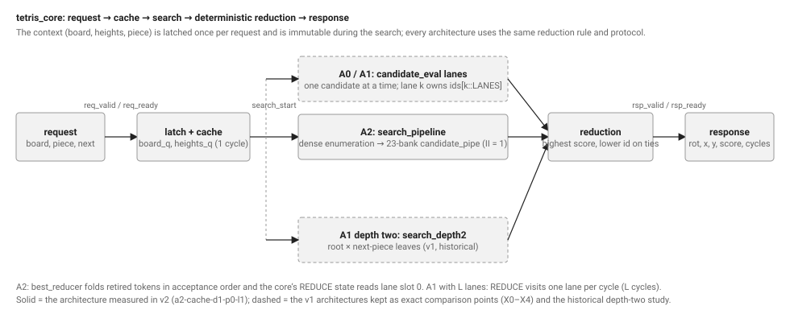
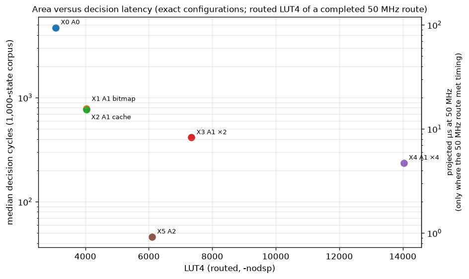
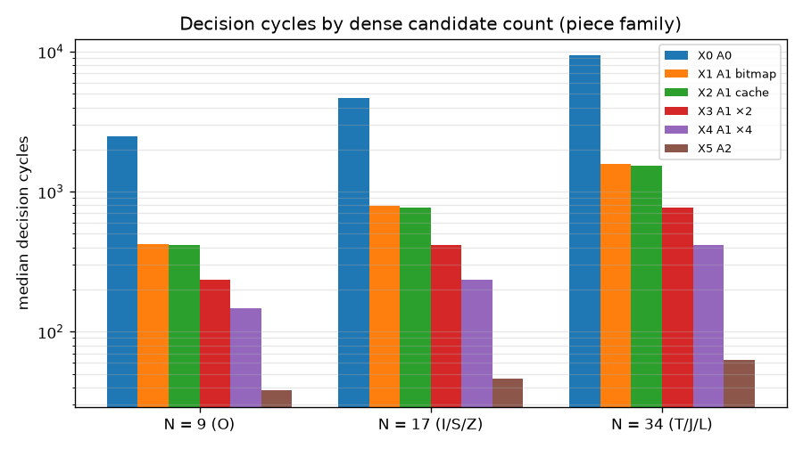
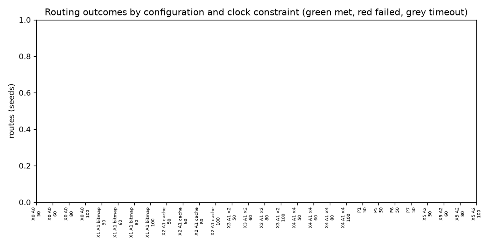
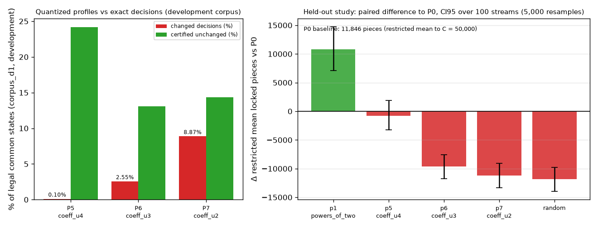

# A pipelined candidate evaluator for drop-only Tetris: an architecture study with reproducible evidence

*Every number in this report is recomputed from a file in `results/` by `tools/check_claims.py`
(`docs/claims.json`) or is quoted from a generated table in [`docs/results.md`](results.md). Times are
labelled: "cycles" are RTL-simulation clock cycles under the documented protocol; "routed" figures are
nextpnr timing reports on the ECP5 LFE5U-85F device model with auto-allocated I/O; "wall" is host time.
Nothing was measured on a board. The rules are a simplification of Tetris (`drop-v1.1`, §1) and no number
here is comparable to workers playing other rules.*

## 1. Problem and contract

The game is fixed by `docs/spec.md` (`drop-v1.1`): a 10×20 board, seven tetrominoes with a fixed
orientation table, and drop-only placement — a piece is chosen by rotation and column, falls
straight down until it rests, and locks. There are no kicks, tucks, spins, holds, timing or scoring
rules beyond line count. A candidate is `candidate_id = 10·rotation + x`; the dense list of legal
geometries has 9 entries for O, 17 for I, S and Z and 34 for T, J and L. The objective the hardware
must compute exactly is the one-piece search

```text
S(c) = 76·L(c) − 51·A(c) − 36·Q(c) − 18·U(c)      (lines cleared, aggregate height, holes, bumpiness)
best = argmax S(c) over legal c, ties to the lower candidate_id; no legal c → canonical no-move
```

with the coefficients of an attributed baseline heuristic (Lee, 2013; `NOTICE.md`), not tuned here.
Two independent software references define correctness: the literal-descent model
(`model/game.py`, the oracle of record) and a grid reference used only by tests
(`tests/reference_grid.py`). A hardware configuration is *exact* when its decision equals the oracle's
on every state of a corpus; the eight numerical profiles P0–P7 are alternative coefficient sets that
are each exact with respect to their own definition and are compared as *policies* (§5.5).

The question of the study is architectural: given that the objective is fixed and cheap per
candidate, what is the cheapest hardware that returns the exact best move quickly, and where do the
obvious ways of buying speed — replicating evaluators, pipelining them, narrowing the arithmetic —
stop paying?

## 2. Measured bottleneck

The v1 evaluators are finite-state machines that process one candidate at a time
(`docs/design.md`). Tracing their state residency per candidate (`results/stage_cycles_*.json`) gives
the baseline that motivated the pipeline:

| Evaluator | Cycles per legal candidate | Where they go |
|---|---|---|
| A0 serial, bitmap board (`a0-bitmap-d1-p0-l1`) | 277 | features 213, landing 25, line clear 23 |
| A1 fast, height cache (`a1-cache-d1-p0-l1`) | 40 | line clear 23, landing 3, merge 2, features 3, score 2, control 7 |

An illegal candidate costs 6 cycles in A1. A1 removed the serial feature scan and the serial drop,
and the remaining 40 cycles are dominated by one block: the line-clear compactor, a 20-iteration
loop that shifts surviving rows down one at a time (23 of 40 cycles, 58 %). With the lane FSM's own
steps the cost per legal candidate seen from the core is 45 cycles, and a decision on a state whose
candidates are all legal takes exactly `45·⌈N/L⌉ + 7 + L` cycles for `L` lanes (`docs/lanes.md`):
773 cycles median for one lane on the common 1,000-state corpus and 414 for two.

Two observations shaped the hypothesis for A2. First, even a zero-cycle compactor leaves a serial
evaluator near 17 cycles per candidate, because every stage waits for the previous one; the
structure, not the compactor alone, is the limit. Second, all of the per-candidate work — landing,
merge, clear, features, score — is a pure function of the immutable original board and the
candidate, so candidates are independent and can be overlapped if each carries its own copy of the
board through the stages. The hypothesis: a pipeline that accepts one candidate per cycle and
replaces the iterative compactor with a prefix/select network should make the decision latency
`N + constant`, an order of magnitude below the serial evaluator for N = 17, at an area comparable
to two or three replicated lanes. The measured outcome is in §5; the constant turned out to be 29.

## 3. Architecture




*Figure 1. (a) The core's request/cache/search/reduction/response path shared by all
architectures; A2 replaces the lane array with `search_pipeline`. (b) One frame per clock edge of
the actual RTL (`results/traces/a2_normal_search.json`, checked by `tools/check_trace.py`): 34
candidates enter one per cycle, retire in order, the running best changes on the way, and the
public response arrives 63 cycles after the request. `viewer/demo.html` replays the same trace.*

**Context ownership.** One request owns one immutable context. The core latches `board`, `piece` and
the fifty-bit height cache in its `IDLE`/`CACHE` states and refuses another request until the
response is consumed, so everything a token reads from outside itself — heights at P0, the original
board at P3 — cannot change while any token of the search is in flight. From P3 on each token carries
its private merged board; the compactor and feature stages read no shared state at all. The hazard "a
new board arrives while old candidates are in the pipe" is unreachable by construction, and the
tests make the mechanism observable by scrambling the public inputs after acceptance (V12) and
asserting that a search starts only when the pipe is empty (`issued == retired`).

**Register schedule.** `architecture/a2_stages.json` fixes 23 banks (P0–P22), each one clock edge:
decode/select (P0), height differences and landing (P1–P2), merge (P3), compaction (P4–P12),
features (P13–P19) and score (P20–P22). The four blocks `drop_merge_pipe`, `line_clear_pipe`,
`features_pipe` and `score_pipe` share single register banks at their boundaries.
`make check-a2-spec` checks the manifest, the RTL and the executable cycle model
(`model/a2_token_model.py`) against each other.

**Prefix/select compaction.** Instead of scattering rows into a destination array, the compactor
computes `keep[s] = (row[s] ≠ full)`, an inclusive prefix count of kept rows in five strides
(P5–P9), a match matrix `match[d][s] = keep[s] ∧ rank[s] = d+1` (P10) and the output rows as ORs of
masked sources in two levels (P11–P12). Survivor order is preserved because ranks are strictly
increasing over kept rows; nonadjacent full rows need no special case (`assets/diagrams/compaction.svg`).

**Global advance and best-result feedback.** The pipeline moves as one: `advance = !rst ∧
(!valid[22] ∨ m_ready)`; a blocked output freezes every bank, and reset clears every valid bit with
priority over `advance` (`assets/a2_stall_reset.gif`). The search controller enumerates the dense
index through `cand_rom`, tags each token with that index and marks the last one. Retired tokens
feed a one-register-deep comparator: `take = legal ∧ (¬best_valid ∨ score > best ∨ (score = best ∧
id < best_id))`. When the last token retires, `done` pulses and the published best includes it (the
final candidate may win; `assets/a2_last_candidate_wins.gif`). With B = 23 banks a candidate is
visible at the output 22 edges after acceptance and transferred at edge 23; the candidate
initiation interval is 1; decision latency is `D(N) = N + 29` cycles from request acceptance to
`rsp_valid`, and the single-outstanding public protocol gives a request interval of `N + 31`.

**Replication (A1 lanes) and the ladder (P5–P7)** are the two other knobs of the study. `LANES`
copies of the A1 evaluator each own every `L`-th dense candidate and a `REDUCE` state merges local
winners in index order (`assets/diagrams/lanes.svg`; `docs/lanes.md`). P5–P7 quantize the
coefficients to 4, 3 and 2 bits ((15,10,7,4), (7,5,3,2), (3,2,1,1)) with the same argmax/tie rule; a
certificate `M·(S(g) − S(c)) > E(g) + E(c)` proves, per state, when the exact winner cannot change
(`docs/precision_v2.md`).

## 4. Verification

Correctness rests on independent models and on proofs of the three blocks whose failure modes are
hardest to reach by sampling (`docs/verification_a2.md`, V01–V14):

* *Independent references.* The literal-descent model and the grid reference are kept separate;
  the RTL is never used to define expected values. Whole-core equivalence is tested on the 1,000-state
  v1 corpus and 2,000 development states for A2 (V11), and every v1 configuration on its own
  corpora — 8,250 recorded v1 decisions in `results/decisions/`.
* *Representative edge cases.* All 2^20 keep masks through the actual compactor HDL (V02), 100,000
  arbitrary boards (V03), all 162 geometric candidates on 250 mixed boards (40,500 tokens, V04),
  spawn under an overhang, height-20 columns, every scorer bound (V05), 4,096 back-to-back tokens
  with spacing 1 (V06), 20 % input bubbles with 30 % output stalls (V07), reset at each of the 24
  pipeline occupancies (V08), tag alignment with alternating geometry (V09), and the winner
  hazards: all illegal, one legal, last wins, exact ties with the higher id first (V10).
* *Block proofs.* Unbounded k-induction (SBY/boolector, pinned) of the compactor against an
  independent running-index filter — status `unbounded` in `results/formal/compactor.json` — of the
  best reducer (dominance, provenance, monotonicity) and of the abstract 5-bank control discipline
  (token conservation, ordering, stall stability, reset flush). The proofs cover blocks, not the
  full core; no eventual-completion property is claimed under permanent stalls.
* *Mutation evidence.* Twelve deliberate mutations (tie direction, rank stride, keep polarity,
  advance condition, tag misalignment, …) are each killed by a named check: 12 of 12
  (`results/evidence/U11/mutations.json`).
* *Protocol and replays.* The cocotb protocol and wrapper tests run on A2 (V12), native and cocotb
  drivers agree on every field and cycle count (V13), and full RTL replays of three seeds are
  move-for-move identical to the v1 replays (V14). The trace checker (`tools/check_trace.py`)
  validates the three saved traces of Figure 1 for conservation, ordering, stall stability, reset
  flushing, scores and the final best; the normal-search trace's response takes 63 cycles.

## 5. Results

### 5.1 Exact equivalence on common states

Every supported configuration returns the oracle's move on every state of the common corpus: the
nine v1 configurations on their v1 corpora (8,250 decisions), and `a2-cache-d1-p0-l1`,
`a1-cache-d1-p0-l4` and the P5–P7 cores on 1,000 v2 decisions each (`results/v2/raw/decisions/`,
regenerated by the release matrix). The A2 and four-lane records are, decision for decision,
identical to the one-lane A1 record of the same corpus; only the cycle counts differ.

### 5.2 Area and decision latency



*Figure 2. Routed LUT4 count of each exact configuration against its projected median decision
latency (median cycles on the common corpus divided by the 50 MHz constraint each route met; a
configuration whose 50 MHz routes did not all complete is drawn from its completed record and
marked). Points: `results/v2/figures/area_vs_latency.points.json`.*

| Configuration | Median cycles | Max | Σ cycles (1,000 states) | Speed-up (Σ) | Routed LUT4 / FF at 50 MHz |
|---|---|---|---|---|---|
| `a1-cache-d1-p0-l1` | 773 | 1,538 | 887,469 | 1.0× | 4,030 / 2,220 |
| `a1-cache-d1-p0-l2` | 414 | 774 | 463,569 | 1.91× | 7,345 / 3,738 |
| `a1-cache-d1-p0-l4` | 236 | 416 | 264,092 | 3.36× | 14,035 / 6,773 |
| `a2-cache-d1-p0-l1` | 46 | 63 | 51,943 | 17.1× | 6,104 / 5,489 |

The pipelined evaluator needs 46 cycles for the median state (`N + 29`; 38, 46 and 63 for N = 9, 17,
34, with no other values on 3,000 states) against 773 for the one-lane evaluator, 17.1× fewer
cycles in total, with the same decision on every state. Its cost is area: 1.51× the
LUT4s and 2.47× the flip-flops of one lane, most of it the 23 register banks carrying a
private 200-bit board and the wide match/selection network of the compactor. Per unit of area the
pipeline still wins by a wide margin (Figure 2): four lanes buy 3.36× for 3.48× the LUT4s
(synthesis, §5.3); the pipeline buys 17.1× for 1.51×.

### 5.3 Replication scaling



*Figure 3. Median cycles per decision by dense candidate count N (9, 17, 34) for one, two and four
lanes and for A2; the controller overhead (7 cycles plus one `REDUCE` cycle per lane) and the A2
fill/drain constant (29 cycles) are the intercepts. Companion panel: `lane_scaling.png`.*

On the 654 states whose candidates are all legal the lane count is exactly `45·⌈N/L⌉ + 7 + L`: the
ceiling (34 → 17 → 9 candidates per lane), the extra reduction cycles and the fixed overhead are
the three visible reasons four lanes give 3.36× rather than 4× (per state 1.56×–3.74×, median 3.28×).
Synthesis of the same source (`results/v2/lanes/synth_l1_l2_l4.json`, `synth_ecp5 -nodsp`) grows
from 4,030 LUT4 / 2,220 FF for one lane to 6,773 FF for four, +1,518 flip-flops per added lane:
each lane latches its own copy of the 200-bit board and 50-bit heights twice and holds its own merged
and cleared boards, so at least 900 of the 1,518 are replicated storage that a shared height source
does not remove. The lane-interaction witnesses the guide asked for are real: on 300 corpus states
the winning lane finished strictly last in 95 cases, 74 winners were cross-lane ties decided by the
lowest id, and 62 lane/state pairs had no legal candidate and had to be ignored by the reduction.

### 5.4 Clock sensitivity



*Figure 4. Outcome of every job of the 84-route release matrix (`benchmarks/hardware_v2.json`:
six exact configurations × {50, 60, 80, 100} MHz × seeds {11, 12, 13}, plus P1 and P5–P7 at
50 MHz), and reported fmax per seed in the companion panel `fmax_by_seed.png`. A timeout is the
outcome of that seed under the declared budget (600 s; 1,200 s for four lanes), not proof that the
netlist cannot route.*

All 84 declared jobs have an outcome (`make check-hardware-v2`; protocol and tables in
[`docs/hardware_v2.md`](hardware_v2.md)): 44 met their constraint, 32 routed
but reported an fmax below it, 8 exhausted the budget, none errored; the run took 4.4 h of wall time
on two cores (`results/evidence/U17/matrix_run.log`). The first result is that the constraint did not
move the outcome: for every configuration and seed, nextpnr reported the *same* fmax at 50, 60, 80 and
100 MHz (Figure 4, right panel), so the sweep measures each netlist's achievable clock per seed rather
than a response to timing pressure — 50 and 60 MHz are met wherever routing completed and 80 and
100 MHz fail everywhere. The v1 evaluators sit between 64 and 68 MHz reported (A0 64.70–66.09, A1
65.67–67.90, two lanes 64.08–66.87); the A2 pipeline is the fastest netlist of the study at
72.40–75.63 MHz over its three seeds at 6,104 LUT4 / 5,489 FF, so it evaluates one candidate per
cycle *and* runs a higher clock than the serial evaluators. Four lanes routed on one seed only
(seed 12: 63.24 MHz met at 50 and 60 MHz, failed at 80 and 100) and exhausted the 1,200 s budget on
seeds 11 and 13 at every target — 8 of its 12 jobs — reproducing the U13 pilot's symptom (`router1`
converging at about 100 overflowing nets per 1,000 s). The 50 MHz projection is therefore
withheld for four lanes in `docs/results.md` §1.3 (one of three seeds), while every other
configuration's projection stands on three met routes. The precision cores P1 and P5–P7 all meet
50 MHz on all three seeds (65.12–68.50 MHz) at 3,882–3,941 LUT4, within 4 % of the exact core.

The worst paths group into the categories anticipated in `docs/design_a2.md` §6. For A2 the
development routes (`docs/timing_journal.md`) first showed the P14 height select (a 5-bit maximum
tree; 13.93 ns) and, after replacing the tree by a one-hot priority select with no change to the
register schedule, the `j → cand_rom → shape_rom → hsel` enumeration chain into the P0 height mux
(13.10 ns, 76.36 MHz reported at seed 1). In the release matrix the same chain is the worst path in all 12 routed A2 records
(`u_search.j` → candidate decode → P0 height select, category "A2 enumeration / reducer" in
`docs/results.md` §1.2). The A1-family worst paths are the closed-form landing arithmetic in the drop
unit (`u_drop.d_q` → `y`) in 42 of 52 routed records, the compactor's output register feeding the
feature column encoders on 5 (A1 bitmap seed 13, P5 seed 12) and the lane's dense-index counter
(`u_lane.j` → drop/merge decode) on the other 5 (two lanes seed 13, P1 seed 11);
A0's is its row-by-row descent counter in all 12. The four-lane worst paths are inside one lane's
drop unit, not in the broadcast or the reduction, so the four-lane routing difficulty is congestion
seen by the router, not a longer logic path seen by the timing analyser.

### 5.5 Policy sensitivity: quantization and long-horizon quality



*Figure 5. Left: the share of legal development-corpus decisions that P5, P6 and P7 change, and
the share the integer certificate proves unchanged (`results/v2/precision/development/summary.json`).
Right: paired differences in restricted mean locked pieces against P0 on the 100 held-out seven-bag
streams of protocol `quality-v2-bag50k` (50,000-piece cap) with 95 % bootstrap intervals over 5,000
paired resamples. The product-limit survival curves with their censoring marks are the companion
figure `results/v2/figures/survival_bag50k.png`.*

*Decision level (development corpus, planning data).* Quantizing the coefficients to 4, 3 and 2 bits
changed 1, 25 and 87 of 981 legal decisions on the 1,000-state corpus (P5, P6, P7; 6, 76 and 221 of
1,963 on the 2,000-state development corpus). Every unchanged decision that the certificate marks
as certified is certified soundly (asserted on every state), and each change is explained by its
candidate table in `results/v2/precision/development/divergence_explanations.json`. The saving is
small: the scorer alone falls from 97 to 28 LUT4 (P0 → P7, `synth_ecp5 -nodsp`), the whole A1 core
from 4,030 to 3,883 LUT4 — a 3.6 % core saving that the quality study below shows to be a poor
trade for P6 and P7.

*Policy level (held-out streams, frozen before the run).* The powers-of-two profile P1 survives a
restricted mean of 22,675 locked pieces against 11,846 for the exact baseline P0 — a paired
difference of +10,828 pieces (CI95 [7,082, 14,719]), P1 outlasting P0 on 64 of the 100 streams,
with 13 of its games censored at the cap (2 for P0). P5 is indistinguishable from P0 (-762 pieces,
interval spanning zero, 30 tied streams). P6 and P7 collapse to 2,226 and 680 pieces. The random
legal policy survives 26 pieces. These are observations about fixed policies on this simplified
game, not tuning results: P1 was one of the frozen v1 profiles, and no coefficient search was run.

## 6. Interpretation

**Fill/drain overhead.** The pipeline's 29-cycle constant is 63 % of a median decision (N = 17) and
76 % for O pieces (N = 9). It is the price of 23 banks plus the public protocol's six control
edges, and it explains why A2's advantage grows with N (Figure 3). A shorter pipe would lower the
constant but lengthen each stage's path; the 76 MHz ceiling below says the stages are already the
limit at seed 1. The single-outstanding protocol adds two more edges per request (`N + 31`), so
"one candidate per cycle" is not "one decision per cycle": overlapping requests would need a
multi-context core, which the ownership argument of §3 deliberately excludes.

**Routing and fan-out limits.** The failures at higher clocks are paths, not utilisation: A2's
enumeration chain into the P0 height mux, and for four lanes the broadcast of the 200-bit board and
50-bit heights to four evaluators plus the four-way best multiplexer. Four-lane routing was
seed-dependent even at 50 MHz — seed 1 did not converge in 3,600 s while seed 2 met timing at
65.96 MHz in 214 s (`docs/lanes.md` §5) — and the release matrix records 8 timeouts
under its 1,200 s budget. Those timeouts are recorded outcomes of a seed and a budget; they are not
evidence that the netlist cannot route, and the matrix keeps them rather than re-rolling seeds.

**Capped survival.** All quality figures are restricted means at a 50,000-piece horizon. P1 hit the
cap on 13 of 100 streams, so its true mean is larger than 22,675 and the P1–P0 gap is understated;
medians are reported only where the survival curve crosses one half within the horizon (P0 at
7,880 pieces, P1 at 21,563). The pilot on the development streams was used to choose the cap and
was not reused for the held-out claim; the protocol was frozen (`results/v2/protocol/`) with the
model closure hash before the held-out run, and `make check-quality-v2` rejects records whose
protocol or model source differs from the summary's.

**Where added hardware did not help.** Four lanes cost 3.48× the LUT4s and 3.05× the flip-flops
for 3.36× the cycles — worse than linear on both axes and no better in clock. Narrowing the scorer
saved at most 147 LUT4 of 4,030 while P6 and P7 destroy the policy; only P5 is a free saving, and it
is 121 LUT4. The one change that paid was structural: overlapping independent candidates with a
private board each, which turned 45 cycles per candidate into one and, at 50 MHz, a 46-cycle
median decision into under a microsecond of projected latency. Replacing a maximum tree by a
priority select in P14 was the only timing change made, and it moved the worst path to the
enumeration ROM chain; registering the decoded candidate before P0 (one more bank, `D(N) = N + 30`)
is the obvious next revision and is not made here.

**Limits of the implementation estimates.** All areas and clocks are device-model results from the
pinned OSS CAD Suite with auto-allocated I/O and a controlled DSP policy (`-nodsp`); a real design
would add I/O constraints, a clock network and a host interface, and a board would give a
measured, not reported, fmax. No power figure is given. The v1 implementation rows in
`results/implementation.csv` used the default DSP policy and the v1 toolchain lock and are a
different identity; they are kept as history, not compared here.

*Reproduction:* `make check-claims`, `make check-report-v2`, `make results-v2`; per-record identities
in `docs/identities.md`; runtime and disk of the full study in `docs/results.md`.
